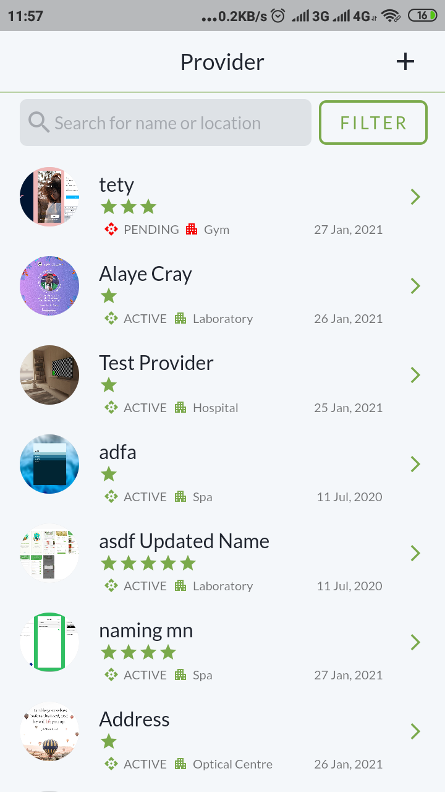

# Prozone

A Healthcare Provider aggregator app

## Description
A mobile application for a provider aggregation by provider officers for managing providers in their network

### Features

The following features are meant to be implemented on the app. (Can't list all 😁)
- [x] View all providers registered in the network
- [x] View Details of a provider
- [x] Add Providers
- [x] Add Images to a providers

### Additional Features
- [x] Update providers details (Active status, description, type etc.)
- [x] Filter providers based on type and onboarding status
- []  Search for providers using the provider name and/or location (Wanted to implement this but time couldn't permit me 😁)

### Architecture

The project uses a clean architecture & MVVM. The following is the major components folders/files of my project
1) /screens - It is my View, it contains the various screen UI on the app
2) /providers - This is my view model, which interacts directly with the UI and also with the network service
3) /models - This contains my model classes
4) /widgets - This contains my widget
6) /test - This contains my unit test

Others include:
/common
/enums
/mixins
/utils etc

### Built With

Following is list of  libraries used in app.
1)

## Widgets

Following is list of important wigdets used in app.(Can't list all 😁)
1)

## Authors

* **Musa Musa A.**  - [lintdeveloper](https://github.com/lintdeveloper)

## License
This project is licensed under the MIT License - see the [LICENSE.md](LICENSE.md) file for details
